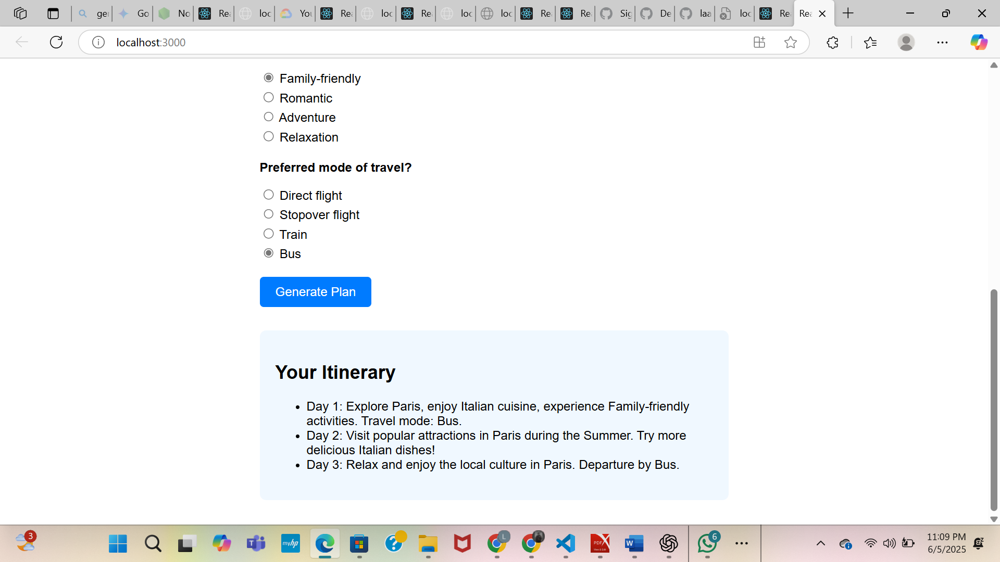

# Travel Concierge

A web app that generates personalized travel itineraries based on user preferences, built with React for the frontend and Node.js/Express for the backend.

---

## Features

- Interactive questionnaire with travel preferences like destination, cuisine, season, travel type, and mode of travel.
- Generates a custom 3-day travel itinerary based on inputs.
- Backend powered by Express server (mocked itinerary generation, can be extended with AI services like Vertex AI).
- CORS enabled for smooth frontend-backend communication.

---

## Tech Stack

- **Frontend:** React, React Scripts
- **Backend:** Node.js, Express, CORS
- **API:** Local REST API endpoint `/generate-itinerary`
- **Dev Tools:** Nodemon (for backend development)

---

## How to Run Locally

### Frontend

1. Navigate to the frontend folder (if separate):
   ```bash
   cd travel-concierge
## App Output Screenshot


